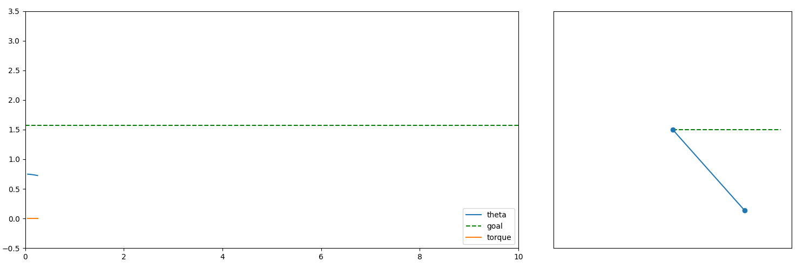
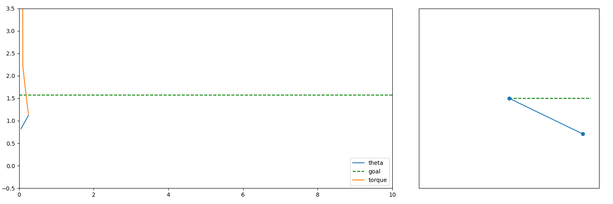

# Control Sim

Simulates a simple pendulum to demonstrate different control laws.

Theta is the angle of the pendulum.
Positive is counterclockwise.
Torque positive is counterclockwise.
theta_accel = - m * g * sin(theta) + torque

Generates frames with matplotlib and combines them into gifs.

_(output of pid controller)_